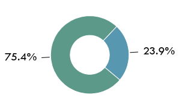
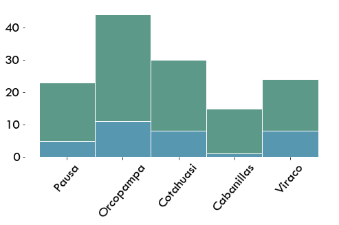
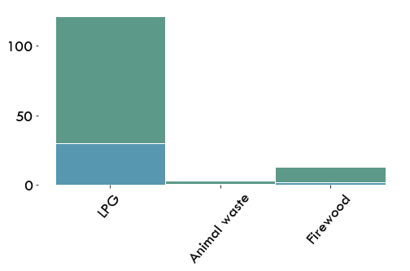
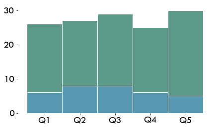

# Safety: Is the cooking solution (stove & fuel) safe?

There are only two possible categorizations of levels. Households that have had accidents and / or do not have sufficient ventilation in the kitchen are in level 3, otherwise in level 5.

* Ventilation in kitchens is not adequate for more than 20% of households
* One fifth of the sample reports having backpain due to kitchen design
* One tenth of households cook in the area where they sleep
* There were 9 cases of accidents

<div markdown="1" class="cell code_cell">
<div class="input_area hidecode" markdown="1">
```python
# load packages
import seaborn as sns
import os,sys
here = os.path.abspath('')
sys.path.insert(0, os.path.normpath(os.path.join(here, '../../src')))
import hedera_types as hedera
import odk_interface as odk
import mtf
import matplotlib.pyplot as plt

plt.rcParams["font.family"] = "Tw Cen MT"
plt.rcParams.update({'font.size': 20})

# load institution data
fondesurco = hedera.mfi(2)
odk_data_dir = '../../_datasets/DataODK/'
odk_survey_folder = ['PEPI_19_03_19/','PEPI_FONDESURCO_19_04_17/']
odk_data_name = [odk_data_dir + odk_survey_folder[0] + 'PEPI_results.csv',
                 odk_data_dir + odk_survey_folder[1] + 
                 'PEPI_FONDESURCO_2_results.csv']
fondesurco.gpsFile = '../../_datasets/Fondesurco/HederaGPS/All.txt'
fondesurco.data_client_file = '../../_datasets/Fondesurco/ClientDatabases/data_with_GPS_3.csv'
data = fondesurco.read_survey(odk_data_name)
fondesurco.HH = odk.households(data)

# get summaries of used sources, fuels, stoces
collection_overview = odk.overview(fondesurco.HH,[fondesurco])

sources_summary = odk.summary(collection_overview,hedera.keys().powerSources,
                              hedera.names('en').powerSources,
                              hedera.keys().powerSourcesColors)
stoves_summary = odk.summary(collection_overview,hedera.keys().stoves,
                             hedera.names('en').stoves,
                             hedera.keys().stovesColors)
fuels_summary = odk.summary(collection_overview,hedera.keys().fuels,
                              hedera.names('en').fuels,
                              hedera.keys().fuelsColors)

```
</div>

</div>

<div markdown="1" class="cell code_cell">
<div class="input_area hidecode" markdown="1">
```python
fondesurco.tier_plots('C_Safety')
```
</div>

<div class="output_wrapper" markdown="1">
<div class="output_subarea" markdown="1">

{:.output_png}


</div>
</div>
<div class="output_wrapper" markdown="1">
<div class="output_subarea" markdown="1">

{:.output_png}


</div>
</div>
</div>

## Safety vs. Solution
Regardless of the kitchen and fuel, homes with firewood, dung or gas report low security.

The two cases of fuel accidents occurred in households that use firewood for cooking. One sixth of gas users can not ventilate or sleep in the same place where they cook.

<div markdown="1" class="cell code_cell">
<div class="input_area hidecode" markdown="1">
```python
hedera.plot_stacked_tier_per_category(fondesurco.HH,"C_Safety",
                                          fuels_summary.used_keys,
                                          'primary_cooking_fuel',
                                          fuels_summary.used_names)
```
</div>

<div class="output_wrapper" markdown="1">
<div class="output_subarea" markdown="1">

{:.output_png}


</div>
</div>
</div>

## Safety vs. Income
The level of income is independent of the occurrence of accidents due to fuel:
Households that reported health and safety issues are found in all quintiles in a similar proportion.

<div markdown="1" class="cell code_cell">
<div class="input_area hidecode" markdown="1">
```python
odk.plot_tiers_per_quintile(fondesurco.HH,'C_Safety')
```
</div>

<div class="output_wrapper" markdown="1">
<div class="output_subarea" markdown="1">

{:.output_png}


</div>
</div>
</div>
