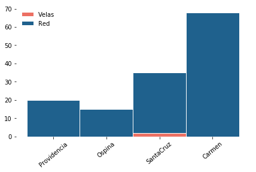
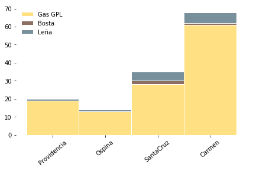
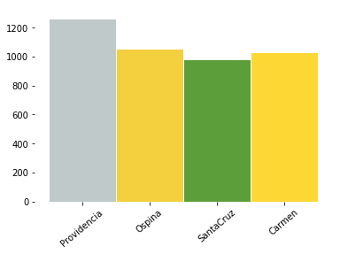
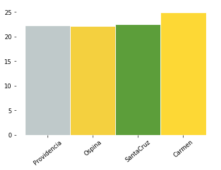
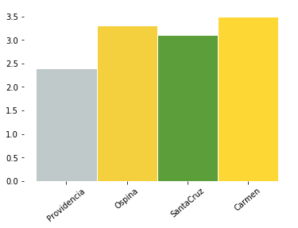
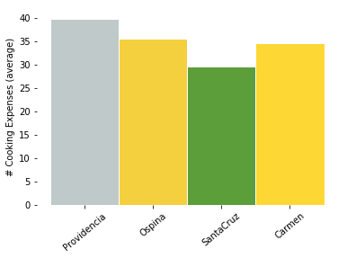
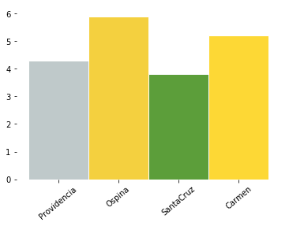
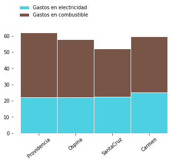

# Acceso a electricidad

<div markdown="1" class="cell code_cell">
<div class="input_area" markdown="1">
```python
import os,sys
here = os.path.abspath('')
sys.path.insert(0, os.path.normpath(os.path.join(here, '../../src')))
import hedera_types as hedera
import odk_interface as odk
import mtf

# institution data
sunrise = hedera.mfi(1)
odk_data_dir = '../../_datasets/DataODK/'
odk_survey_folder = ['PEPI_19_03_19/','PEPI_FONDESURCO_19_04_17/']
odk_data_name = [odk_data_dir + odk_survey_folder[0] + 'PEPI_results.csv',
                 odk_data_dir + odk_survey_folder[1] + 
                 'PEPI_FONDESURCO_2_results.csv']
sunrise.gpsFile = '../../_datasets/Demo/GPS.csv'
data_demo = sunrise.read_survey(odk_data_name)
HH = odk.households(data_demo)
collection_overview = odk.overview(HH,[sunrise])

sources_summary = odk.summary(collection_overview,hedera.keys().powerSources,
                              hedera.names('es').powerSources,
                              hedera.keys().powerSourcesColors)
stoves_summary = odk.summary(collection_overview,hedera.keys().stoves,
                             hedera.names('es').stoves,
                             hedera.keys().stovesColors)
fuels_summary = odk.summary(collection_overview,hedera.keys().fuels,
                              hedera.names('es').fuels,
                              hedera.keys().fuelsColors)
```
</div>

</div>

## Casi la totalidad de los clientes están conectados a la red

En todas las agencias, menos en Orcopampa, todos los clientes encuestados están 
conectados a la red. Dos clientes de los más 
de cuarenta hogares entrevistados en Orcopampa, usan únicamente velas para su iluminación. 

<div markdown="1" class="cell code_cell">
<div class="input_area" markdown="1">
```python
odk.plot_stacked_summary(collection_overview,'es')
```
</div>

<div class="output_wrapper" markdown="1">
<div class="output_subarea" markdown="1">

{:.output_png}


</div>
</div>
<div class="output_wrapper" markdown="1">
<div class="output_subarea" markdown="1">

{:.output_png}


</div>
</div>
</div>

## En promedio los hogares no gastan más de 30 S. al mes en energía.
El gasto máximo en electricidad es de 120 S. La mayoría de los hogares gastan menos de 25 S. mensuales, 
lo que equivale a un promedio de medio jornal (40 - 50 S. día) en el campo. La oficina que menos gastos en energía presentó es Pausa. 
En esta existe el suministro de luz comunitaria donde todos los hogares pagan el mismo monto mensual.

<div markdown="1" class="cell code_cell">
<div class="input_area" markdown="1">
```python
odk.plot_expenses_per_category(HH,'locality',sunrise.offices,
                                   sunrise.offices,
                                   'green',sunrise.office_color)
```
</div>

<div class="output_wrapper" markdown="1">
<div class="output_subarea" markdown="1">

{:.output_png}


</div>
</div>
<div class="output_wrapper" markdown="1">
<div class="output_subarea" markdown="1">

{:.output_png}


</div>
</div>
<div class="output_wrapper" markdown="1">
<div class="output_subarea" markdown="1">

{:.output_png}


</div>
</div>
<div class="output_wrapper" markdown="1">
<div class="output_subarea" markdown="1">

{:.output_png}


</div>
</div>
<div class="output_wrapper" markdown="1">
<div class="output_subarea" markdown="1">

{:.output_png}


</div>
</div>
<div class="output_wrapper" markdown="1">
<div class="output_subarea" markdown="1">

{:.output_png}


</div>
</div>
</div>
