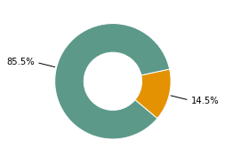
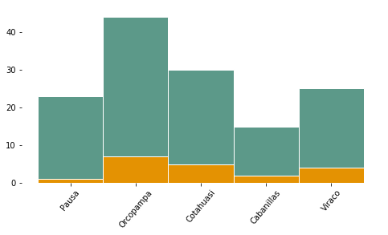
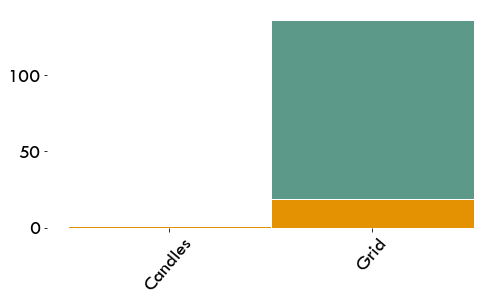
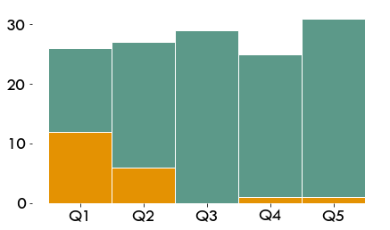

# Affordability: Can the household pay for the energy?

There are only two possible categorizations of levels. Households with a consumption cost higher than 5% of their income are in level 2, otherwise in level 5.

## MTF Ranking (Affordability)
 
For 15% of households, electricity expenditures represent more than 5% of their income.

With energy costs of up to 120 S /., for 14.5% of respondents, these expenses add up to more than 5% of their monthly income (Tier 2), despite the few appliances they use. On average, households spend around 20 S /. a month in electricity.

<div markdown="1" class="cell code_cell">
<div class="input_area hidecode" markdown="1">
```python
# load packages
import seaborn as sns
import os,sys
here = os.path.abspath('')
sys.path.insert(0, os.path.normpath(os.path.join(here, '../../src')))
import hedera_types as hedera
import odk_interface as odk
import mtf
import matplotlib.pyplot as plt
plt.rcParams["font.family"] = "Tw Cen MT"
plt.rcParams.update({'font.size': 20})

# load institution data
fondesurco = hedera.mfi(2)
odk_data_dir = '../../_datasets/DataODK/'
odk_survey_folder = ['PEPI_19_03_19/','PEPI_FONDESURCO_19_04_17/']
odk_data_name = [odk_data_dir + odk_survey_folder[0] + 'PEPI_results.csv',
                 odk_data_dir + odk_survey_folder[1] + 
                 'PEPI_FONDESURCO_2_results.csv']
fondesurco.gpsFile = '../../_datasets/Fondesurco/HederaGPS/All.txt'
fondesurco.data_client_file = '../../_datasets/Fondesurco/ClientDatabases/data_with_GPS_3.csv'
data = fondesurco.read_survey(odk_data_name)
fondesurco.HH = odk.households(data)

# get summaries of used sources, fuels, stoces
collection_overview = odk.overview(fondesurco.HH,[fondesurco])

sources_summary = odk.summary(collection_overview,hedera.keys().powerSources,
                              hedera.names('en').powerSources,
                              hedera.keys().powerSourcesColors)

data_client_path = '../../_datasets/Fondesurco/ClientDatabases/data_with_GPSs_2.csv'
data_econ_act_path = '../../_datasets/Fondesurco/ClientDatabases/data_econ_activity.csv'
HH_all_client = fondesurco.merge_with_client_data(fondesurco.HH,
                                                  data_client_path,
                                                  data_econ_act_path)

# TO DO..
# update HH with HH database of institution
# fondesurco.merge_with_client_data(data_client_path,data_econ_act_path)


# plot MTF Affordability
fondesurco.tier_plots('E_Affordability')

```
</div>

<div class="output_wrapper" markdown="1">
<div class="output_subarea" markdown="1">

{:.output_png}


</div>
</div>
<div class="output_wrapper" markdown="1">
<div class="output_subarea" markdown="1">

{:.output_png}


</div>
</div>
</div>

## Affordability vs. Energy source
 
Households using candles are in the lowest Tier.

<div markdown="1" class="cell code_cell">
<div class="input_area hidecode" markdown="1">
```python

# affordability vs energy source
hedera.plot_stacked_tier_per_category(fondesurco.HH,'E_Affordability',
                                      sources_summary.used_keys,
                                      'primary_electricity_source',
                                      sources_summary.used_names)
```
</div>

<div class="output_wrapper" markdown="1">
<div class="output_subarea" markdown="1">

{:.output_png}


</div>
</div>
</div>

## Affordability vs. Income
 
Households in the lowest quintiles (Q1 and Q2) have the greatest affordability barriers.

<div markdown="1" class="cell code_cell">
<div class="input_area hidecode" markdown="1">
```python
odk.plot_tiers_per_quintile(fondesurco.HH,'E_Affordability',figPath=None)
```
</div>

<div class="output_wrapper" markdown="1">
<div class="output_subarea" markdown="1">

{:.output_png}


</div>
</div>
</div>
