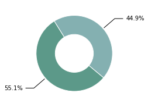
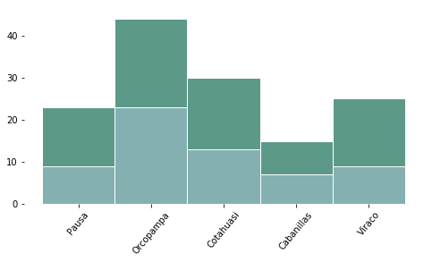

## ¿Es el servicio de electricidad confiable?

La confiabilidad está determinada por la cantidad de cortes del suministro de electricidad y su duración. 


<div markdown="1" class="cell code_cell">
<div class="input_area" markdown="1">
```python
import os,sys
here = os.path.abspath('')
sys.path.insert(0, os.path.normpath(os.path.join(here, '../../src')))
import hedera_types as hedera
import odk_interface as odk
import mtf
from pivottablejs import pivot_ui

fondesurco = hedera.mfi(2)
odk_data_dir = '../../_datasets/DataODK/'
odk_survey_folder = ['PEPI_19_03_19/','PEPI_FONDESURCO_19_04_17/']
odk_data_name = [odk_data_dir + odk_survey_folder[0] + 'PEPI_results.csv',
                 odk_data_dir + odk_survey_folder[1] + 
                 'PEPI_FONDESURCO_2_results.csv']
fondesurco.gpsFile = '../../_datasets/Fondesurco/HederaGPS/All.txt'
fondesurco.data_client_file = '../../_datasets/Fondesurco/ClientDatabases/data_with_GPS_3.csv'
data = fondesurco.read_survey(odk_data_name)
fondesurco.HH = odk.households(data)

```
</div>

</div>

### Distribución

### Calificación MTF

<div markdown="1" class="cell code_cell">
<div class="input_area" markdown="1">
```python
fondesurco.tier_plots('E_Reliability')
```
</div>

<div class="output_wrapper" markdown="1">
<div class="output_subarea" markdown="1">

{:.output_png}


</div>
</div>
<div class="output_wrapper" markdown="1">
<div class="output_subarea" markdown="1">

{:.output_png}


</div>
</div>
</div>

#### Por quintiles

#### Por género

### Tabla interactiva

<div markdown="1" class="cell code_cell">
<div class="input_area" markdown="1">
```python
pivot_ui(fondesurco.HH, outfile='/Users/nataliarealpecarrillo/Documents/HEDERA/code/pepi/report-0/content/pivottablejs.html')
```
</div>

<div class="output_wrapper" markdown="1">
<div class="output_subarea" markdown="1">


<div markdown="0" class="output output_html">

        <iframe
            width="100%"
            height="500"
            src="pivottablejs.html"
            frameborder="0"
            allowfullscreen
        ></iframe>
        
</div>


</div>
</div>
</div>
