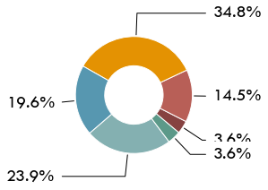
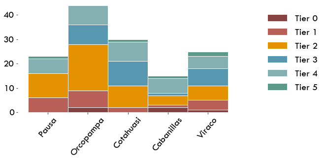

# Energy Services

¿Qué tipos de servicios de energía tienen acceso los hogares según sus electrodomésticos?


<div markdown="1" class="cell code_cell">
<div class="input_area" markdown="1">
```python
import os,sys
here = os.path.abspath('')
sys.path.insert(0, os.path.normpath(os.path.join(here, '../../src')))
import hedera_types as hedera
import odk_interface as odk
import mtf
import matplotlib.pyplot as plt
plt.rcParams["font.family"] = "Tw Cen MT"
plt.rcParams.update({'font.size': 20})

fondesurco = hedera.mfi(2)
odk_data_dir = '../../_datasets/DataODK/'
odk_survey_folder = ['PEPI_19_03_19/','PEPI_FONDESURCO_19_04_17/']
odk_data_name = [odk_data_dir + odk_survey_folder[0] + 'PEPI_results.csv',
                 odk_data_dir + odk_survey_folder[1] + 
                 'PEPI_FONDESURCO_2_results.csv']
fondesurco.gpsFile = '../../_datasets/Fondesurco/HederaGPS/All.txt'
fondesurco.data_client_file = '../../_datasets/Fondesurco/ClientDatabases/data_with_GPS_3.csv'
data = fondesurco.read_survey(odk_data_name)
fondesurco.HH = odk.households(data)
```
</div>

</div>

## Clasificación MTF

Según los aparatos que disponga y haga uso el hogar, se clasifican estos siguiendo la matriz de evaluación del MTF.

Las aplicaciones encontradas en el campo reflejan el limitado uso de servicios eléctricos usados en la región. La mayoría de los hogares se caracterizan por consumir poca electricidad. Un cuarto de la muestra, además de los aparatos de comunicación y entretenimiento, también cuenta con electrodomésticos como la plancha y licuadora de mayor consumo de energía. Solo 4 hogares reportaron tener duchas eléctricas para calentar el agua al bañarse.


<div markdown="1" class="cell code_cell">
<div class="input_area hidecode" markdown="1">
```python

fondesurco.tier_plots('E_Services',legend=True)

```
</div>

<div class="output_wrapper" markdown="1">
<div class="output_subarea" markdown="1">

{:.output_png}


</div>
</div>
<div class="output_wrapper" markdown="1">
<div class="output_subarea" markdown="1">

{:.output_png}


</div>
</div>
</div>

## Appliances
 
Casi el 50% de los hogares cuentan sola- mente con celulares, iluminación, radio y televisor.

 
Después de la iluminación y los teléfonos celulares, más de la mitad de los hogares tienen radio y televisor a color. Electrodomésticos que facilitan labores del hogar como la lavadora o lavavajillas fueron de mínima ocurrencia. Menos del 20% usan refrigeradora, encontrada en todas las oficinas en similar proporción, quien después de la plancha y la licuadora, son los electrodomésticos encontrados más frecuentemente en el campo. Los dos casos de hogares usando velas, no contaban con ninguna aplicación alimentada por otra fuente de energía. La percepción de los hogares con respecto a los aparatos que más consumen indicaron que los televisores (55%), los refrigeradores (15%), y los radios (10%), son aquellos que, según su percepción, más afectan los recibos de luz.

