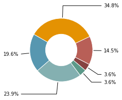
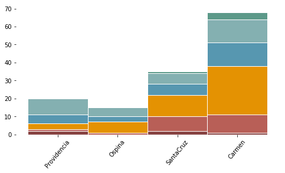

# Servicios

<div markdown="1" class="cell code_cell">
<div class="input_area hidecode" markdown="1">
```python
import os,sys
here = os.path.abspath('')
sys.path.insert(0, os.path.normpath(os.path.join(here, '../../src')))
import hedera_types as hedera
import odk_interface as odk
import mtf

# institution data
sunrise = hedera.mfi(1)
odk_data_dir = '../../_datasets/DataODK/'
odk_survey_folder = ['PEPI_19_03_19/','PEPI_FONDESURCO_19_04_17/']
odk_data_name = [odk_data_dir + odk_survey_folder[0] + 'PEPI_results.csv',
                 odk_data_dir + odk_survey_folder[1] + 
                 'PEPI_FONDESURCO_2_results.csv']
sunrise.gpsFile = '../../_datasets/Demo/GPS.csv'
data_demo = sunrise.read_survey(odk_data_name)
HH = odk.households(data_demo)
collections = odk.overview(HH,[sunrise])
```
</div>

</div>

### La mayoría de los hogares se encuentran en el nivel 1 de acceso a energía

A pesar de la casi total cobertura de la red el 98% de los hogares encuestados, dista de ser un suministro de electricidad de calidad. Cerca al 80% de la muestra se encuentran en los niveles más bajos de clasificación de acceso (nivel 1, 60.1% y en nivel 2, el 16.7%). Ninguno de los hogares alcanzó la clasificaci\'on en el mejor nivel de suministro de energía, nivel 5. Esto demuestra una necesidad de mejora de los atributos asociados al suministro, los cuales serán detallados a continuación.

<div markdown="1" class="cell code_cell">
<div class="input_area" markdown="1">
```python
sunrise.tier_plots(HH,'E_Services')
```
</div>

<div class="output_wrapper" markdown="1">
<div class="output_subarea" markdown="1">

{:.output_png}


</div>
</div>
<div class="output_wrapper" markdown="1">
<div class="output_subarea" markdown="1">

{:.output_png}


</div>
</div>
</div>

### Hay una correlación entre el nivel de suministro de electricidad y los ingresos mensuales

En el quintil más bajo de ingresos se observan aún hogares clasificados en niveles superiores (3). Por otro lado, en los quintiles más altos, 4 y 5 todavía se encuentran hogares en los niveles más bajos, 0. A diferencia de lo esperado, sobre el 50% de los hogares en el cuarto quintil, están en el nivel 1 de suministro de electricidad.
