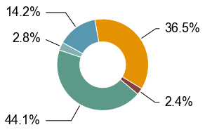
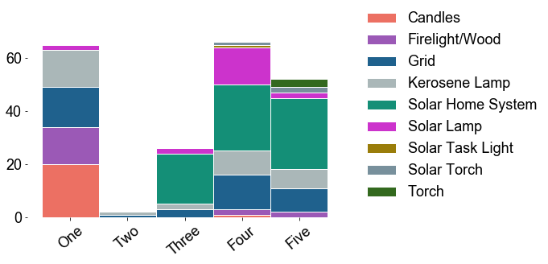
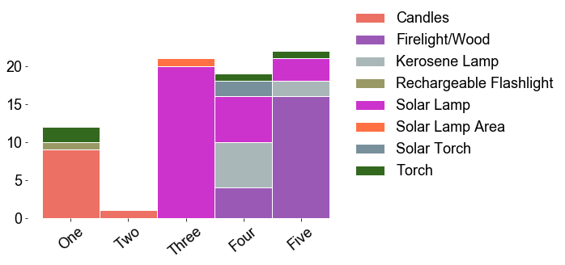

# Electricity sources

<div markdown="1" class="cell code_cell">
<div class="input_area hidecode" markdown="1">
```python
import os,sys
here = os.path.abspath('')
sys.path.insert(0, os.path.normpath(os.path.join(here, '../../src')))
import hedera_types as hedera
import odk_interface as odk
import mtf
from pivottablejs import pivot_ui
import matplotlib.pyplot as plt

# change plot layout
plt.rcParams["font.family"] = "Tw Cen MT"
plt.rcParams.update({'font.size': 20})

odk_data_dir = '../../_datasets/DataODK/'
odk_folder_dir = 'HEDERA_SDG7/'
#odk_folder_dir = 'HEDERA_SDG7_19_07_05/'
## @brief name of the file (this should not be changed, it is set from ODK)
odk_data_name = 'HEDERA_SDG7_results.csv'


# initialize the institution
mfi = hedera.mfi(4)
# read database
data = mfi.read_survey(odk_data_dir + odk_folder_dir+odk_data_name,
                           delimiter='-')


mfi.HH = odk.households(data)
```
</div>

</div>

### MTF Index (Access to electricity)


<div markdown="1" class="cell code_cell">
<div class="input_area hidecode" markdown="1">
```python

mfi.tier_pie('C_Index')

```
</div>

<div class="output_wrapper" markdown="1">
<div class="output_subarea" markdown="1">

{:.output_png}


</div>
</div>
</div>

## Electricity sources
### Primary sources

<div markdown="1" class="cell code_cell">
<div class="input_area hidecode" markdown="1">
```python
mfi.electricity_sources_summary(legend=True)
```
</div>

<div class="output_wrapper" markdown="1">
<div class="output_subarea" markdown="1">

{:.output_png}


</div>
</div>
</div>

<div markdown="1" class="cell code_cell">
<div class="input_area hidecode" markdown="1">
```python
### Primary and Secondary
```
</div>

</div>

<div markdown="1" class="cell code_cell">
<div class="input_area hidecode" markdown="1">
```python
collection_overview = odk.overview(mfi.HH,mfi)
odk.plot_electricity_sources(collection_overview,'en')
```
</div>

<div class="output_wrapper" markdown="1">
<div class="output_subarea" markdown="1">

{:.output_png}


</div>
</div>
</div>

## MTF Electricity Index vs. Primary Source

<div markdown="1" class="cell code_cell">
<div class="input_area hidecode" markdown="1">
```python
mfi.stacked_tier_per_category('E_Index',hedera.keys().powerSources,
                              'primary_electricity_source',
                              hedera.names('en').powerSources,legend=True)
```
</div>

<div class="output_wrapper" markdown="1">
<div class="output_subarea" markdown="1">

{:.output_png}


</div>
</div>
</div>
