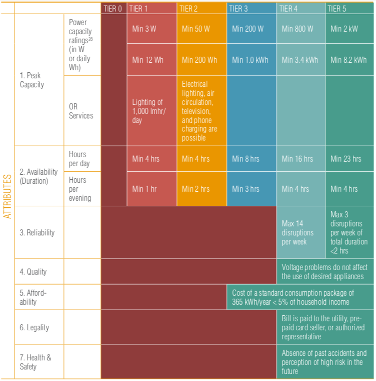

# Measuring Energy Access: the Multi-Tier Framrwork

## The importance of measuring energy access

The concept and measurement of access to energy are of utmost importance to governments and development agencies in order to adapt the appropriate policies and programs to achieve global objectives. The Sustainable Energy for All initiative (SE4All) launched by the Secretary General of the United Nations in 2011 aims to achieve universal access to modern energy services by 2030. The [Sustainable Development Goal (SDG) number 7](https://sustainabledevelopment.un.org/sdg7), adopted in 2015 by all nations, aims to: ensure access to affordable, safe, sustainable and modern energy for all by 2030. Worldwide, it is estimated that more than two billion people lack access to modern energy.

To monitor progress towards the goals of access to energy for all, the Energy Sector Management Assistance Program (ESMAP) of the World Bank and the International Energy Agency have led a consortium of 23 agencies international guidelines to establish the Global Monitoring Framework of the SE4All (Global Track Framework - GTF) that describes how to measure the baseline and progress towards the goals of the SE4All by collecting energy data regularly.

ESMAP, under the SE4ALL initiative, in consultation with multiple development partners, has developed the [Multi-Tier Framework](https://www.esmap.org/node/55526) (MTF) to monitor and evaluate access to energy following a multidimensional methodology.

## A multidimensional, definition of access to energy

The MTF redefines the access to energy from traditional binary accounting (*connected or not connected, cooking with firewood or not*) to a multidimensional definition such as **the ability to take advantage of adequate energy, available when necessary, reliable, good quality, convenient, affordable, legal, healthy and safe for all required energy services**.

That is, having an electrical connection does not necessarily mean having access to electricity according to the new definition, but it also takes into account other aspects, such as, for example, reliability, affordability, among other attributes. Thus, access to energy is measured in the spectrum of levels, from Level 0 (*tier 0*) (without access) to Level 5 (*tier5*) (the highest level of access).

### Ranking matrix to evaluate household energy access

Access to electricity is measured based on standards (attributes) of multiple levels, independent from the energy technology. The successive thresholds of these attributes that are associated with the supply, allow a greater use of electrical appliances. The relevant attributes to evaluate the electricity of the households estimated by the MTF methodology are:

* **Capacity:** What appliances can the household use?
* **Duration (including daily supply and night supply):** Is the power source available when the household needs it?
* **Reliability:** Is electricity service interrupted frequently?
* **Quality:** Does the fluctuation of the voltage damage the appliances?
* **Affordability:** Can the household afford to buy the minimum amount of electricity?
* **Legality:** Is the service provided formally or informally?
* **Health and Safety:** Is it safe to use electricity service or are the household members risking your health if you use the service?

Each attribute is evaluated separately and the general level for household access to electricity is calculated by applying the lowest level obtained in any of the attributes. That is, the attribute with the lowest rating determines the household energy access level (tier).

        
 

### Ranking matrix to evaluate  access to energy services

The MTF methodology defines a separate framework for measuring access to electricity services. A gradual improvement of the electricity supply allows greater and better access to different appliances for different needs. Thus, in a second matrix that measures access to electricity services, the categorization is according to the type of appliances used in the home. A household may obtain ratings at different levels through access to electricity supply and access to electricity services, reflecting the availability of appliances despite poor supply or inability to purchase appliances (or high consumption) of electricity) despite the adequate supply.

        
 

### Ranking matrix to evaluate access to modern cooking solutions

The multi-level framework for measuring access to cooking energy is based on seven attributes:
(i) health (based on indoor air pollution), (ii) convenience (based on fuel collection time and stove preparation time), (iii) safety, (iv) affordability (including spending on stoves and fuel), (v) efficiency, (vi) quality and (vii) availability. In this methodology, a cooking system refers to the combination of a stove and a type of cooking fuel. A cooking system includes all the cooking solutions that are used, as well as the place of cooking and ventilation.

Data on access to cooking energy such as ventilation, the quality of the fuel used, convenience, availability and affordability can be collected through household surveys. Other parameters, such as indoor air quality and efficiency, can be better measured through supply side data based on laboratory tests or estimation based on mathematical models.

* **Affordability:** Can the household pay for both the kitchen and the fuel?
* **Convenience:** How long does it take the household to get and prepare fuel and cooking before a person in the household can cook?
* **Availability:** Is the fuel available when the home needs it to cook?
* **Quality:** Does the quality of the fuel affect cooking?
* **Security:** Is it safe to use the kitchen or is the person exposed to possible accidents? Have accidents occurred in the past due to the use of fuel?

The standards for the measurement of multiple attributes to describe access to cooking systems of households are summarized in the following table. **The lowest level among all the attributes determines the general access to the kitchen level for the home**. 

        
 

