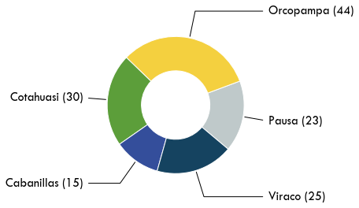
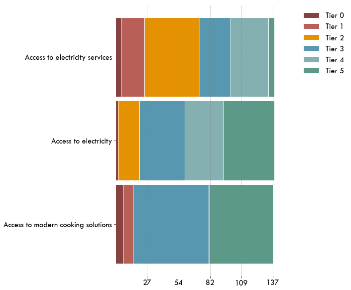
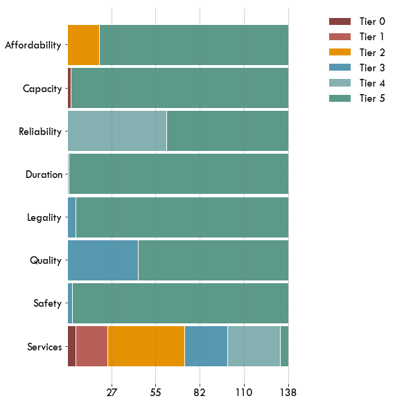
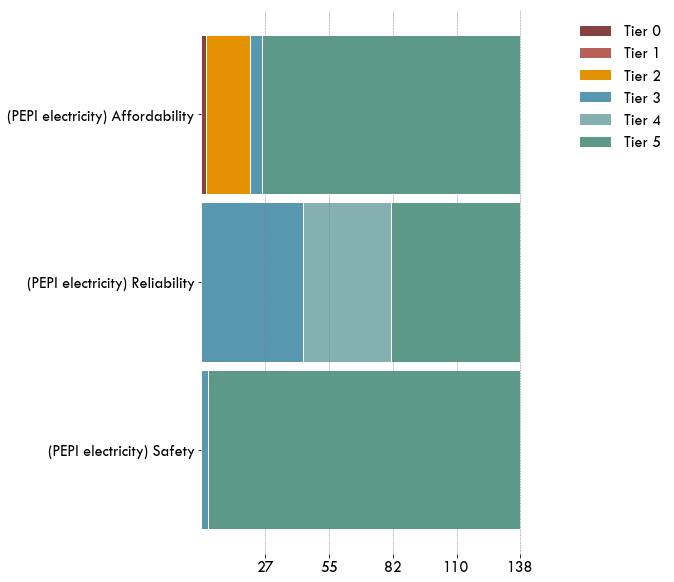
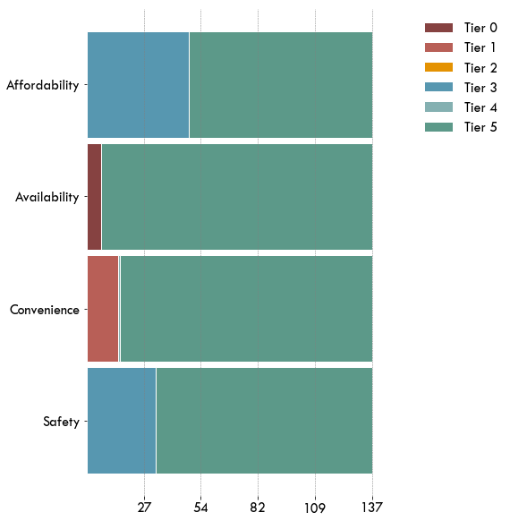
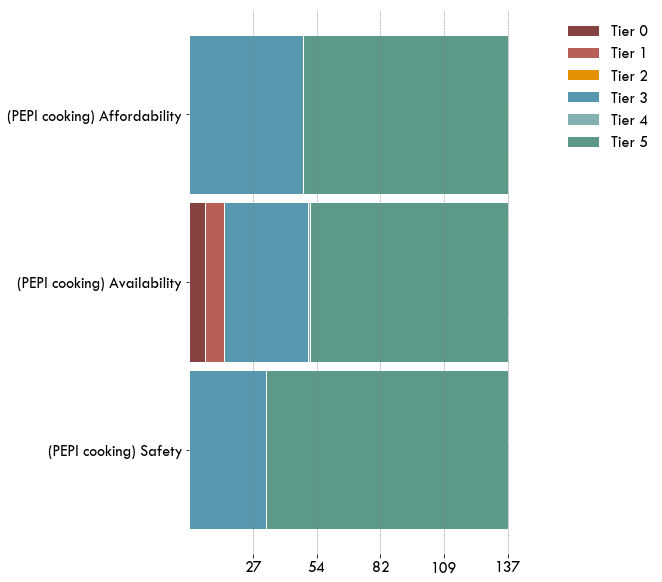

# Executive Summary

Energy access is multidimensional. In order to quantify and address energy demand and energy needs of the rural population, it is highly necessary to implement tools that are not limited to a purely binary assessment (household connected/not connected to the grid). Assessing energy needs shall take into account a wider range of attributes, measuring energy access in terms of affordability, reliability, quality, and safety of energy, as well as include the possibility of using modern and alternative sources (e.g., solar home systems, mini-grids).
The purpose of this study was to assess energy access of 137 households in the region of Arequipa (Peru). 
The approach implemented is based on the Multi-Tier Framework (MTF), developed by The World Bank.

The sample - and the evaluation of the energy access attributes - allows also to evaluate a baseline with respect to 
[SDG7](https://sustainabledevelopment.un.org/sdg7):
**Affordable, reliable, and safe energy for all**.
The baseline evaluation is based on standard metrics, implementing the
[Multi-Tier Framework (MTF)](https://www.esmap.org/node/55526) developed 
by the ESMAP sector of The World Bank. The case study is also a pioneer application of the 
[Progress out of Energy Poverty Index (PEPI)](https://depositonce.tu-berlin.de/handle/11303/6708),
which is also based on the MTF.


<p>
        
 </p>

## HEDERA collect
[HEDERA collect](http://hedera.online/sdg7/index.html) is a mobile App (Android OS) designed for
capturing all relevant information at the household level, in order to efficiently assess and monitor the progress towards
the Sustainable Development Goals. The first area of application of HEDERA collect is the access to energy 
[SDG7](https://sustainabledevelopment.un.org/sdg7). HEDERA collect integrates an optimized version 
of the detailed energy access assessment survey, 
tailored to microfinance institution and suitable for offline application, which allows to drastically reduce the data collection costs.

## The HEDERA Impact Toolkit (HIT)
The ESMAP survey is available in English as [PDF](https://datacatalog.worldbank.org/dataset/rwanda-multi-tier-framework-mtf-survey-2018), along with the data collected in several countries.

[HEDERA](http://hedera.online) has optimized the energy survey, 
in order to facilitate its implementation (reducing training time,
automatically validating data, optimizing the logic tree), especially in the rural context. 
The mobile survey developed by [HEDERA](http://hedera.online) can be completed 
in less than 15 minutes, extracting all the information required for characterizing access to energy at the household level according to MTF.

The evaluation and tier-ranking are then performed automatically, so that users can visualize with minimal effort the
detailed tier ranking of the surveyed clients.
[HEDERA](http://hedera.online) allows therefore institutions to make demand-driven decisions based on real information at the most detailed level.

<div markdown="1" class="cell code_cell">
<div class="input_area hidecode" markdown="1">
```python
# load HIT libraries and institution data

# load packages
import os,sys
here = os.path.abspath('')
sys.path.insert(0, os.path.normpath(os.path.join(here, '../../src')))
import hedera_types as hedera
import odk_interface as odk
import mtf
import matplotlib.pyplot as plt

# change plot layout
plt.rcParams["font.family"] = "Tw Cen MT"
plt.rcParams.update({'font.size': 16})


# load institution data
fondesurco = hedera.mfi(2)
odk_data_dir = '../../_datasets/DataODK/'
odk_survey_folder = ['PEPI_19_03_19/','PEPI_FONDESURCO_19_04_17/']
odk_data_name = [odk_data_dir + odk_survey_folder[0] + 'PEPI_results.csv',
                 odk_data_dir + odk_survey_folder[1] + 
                 'PEPI_FONDESURCO_2_results.csv']
fondesurco.gpsFile = '../../_datasets/Fondesurco/HederaGPS/All.txt'
fondesurco.data_client_file = '../../_datasets/Fondesurco/ClientDatabases/data_with_GPS_3.csv'
data = fondesurco.read_survey(odk_data_name)
fondesurco.HH = odk.households(data)

# get summaries of used sources, fuels, stoces
collection_overview = odk.overview(fondesurco.HH,[fondesurco])

```
</div>

</div>

## Objectives

### Why measuring energy access?
Defining the concept and measurement of **access to energy** is of great importance to governments and development agencies in order to design and adapt the appropriate policies and programs to achieve the objectives of energy supply for the population. The Sustainable Energy for All initiative (SE4All) launched by the Secretary General of the United Nations in 2011 aims to achieve universal access to modern energy services by 2030. The Sustainable Development Goal 7 (SDG7), adopted in 2015 by all nations, 
explicitly aims to achieve access to affordable, safe, sustainable and modern energy for all by 2030. 
According to the 
[Tracking SDG7: The Energy Progress Report de 2019](https://www.irena.org/publications/2019/May/Tracking-SDG7-The-Energy-Progress-Report-2019), worldwide, it is estimated that more than two billion people lack access to modern energy (grid connection and/or clean and safe fuel for cooking).

### A multi-dimensional approach for assessing energy access: The Multi-tier Framework
To monitor progress towards the goals of energy access for all, the global and multi-donor technical assistance trust fund, the Energy Sector Management Assistance Program (ESMAP) of the World Bank and the International Energy Agency have led a consortium of 23 international agencies to establish the Global Monitoring Framework of the SE4All (*Global Track Framework* - GTF).
It describes how to measure the baseline and progress towards the goals of the SE4All by collecting energy data with regularity.
ESMAP, in the framework of the SE4ALL initiative, and in consultation with multiple development partners, has developed the 
[Multi-tier Framework](https://www.esmap.org/node/5552)(MTF) to monitor and evaluate access to energy following a multidimensional methodology to define both the concept of energy and the parameters for its measurement and monitoring. 

Traditionally, access to energy has been measured in a binary way:  connected or not connected, cooking with biomass or not.  However, these metrics overlook the quality of the connection, such as the capacity of other technologies to provide energy, such as home solar systems or mini-grids. 

The need of a multidimensional assessment brought to the definition of the Multi-Tier Framework (MTF), launched by The World Bank
in 2015, with the explicit objective to become the new global measurement standard (in each country) for 
define and monitor the goals of electrification programs, and highlight  the most important challenges 
to improve access to affordable, reliable and safe energy.
For this new methodology, ESMAP has designed a detailed global survey to monitor access to energy at various levels. The main objectives of the survey are:


* To establish a global baseline of access to energy, according to the multidimensional definition of the MTF approach;
* To transfer capacity to national statistical offices to track progress towards the goals of SE4ALL and the SDGs in the future;
* To continue to improve the tools and capabilities to track progress towards the SE4ALL goal of universal access to modern energy services by the year 2030, based on MTF;
* To provide reliable data on the energy sector that can meet the needs of multiple stakeholders, including government, regulators, public services, project developers, civil society organizations, development agencies, financial institutions, appliance manufacturers, international programs, and academia.


Through detailed household surveys, the collected information allows 
to answer the main questions related to energy access: how many lack adequate access to energy, how many need to improve access, and what measures will be taken. In this way, the development of the MTF and the methodology represent a milestone for the sector that should be the basis and language for all actors, not only for quantifying, but also for monitoring the progress of access to energy for all.


## Results

Over a period of 5 weeks, 137 surveys were conducted with households in 5 rural offices of Fondesurco. 
%
Of the total sample, 99% is connected to the network, 80% cook mainly with gas balloon. 
The MTF energy access index of the sample was 46.6/100, while the MTF index for access to modern cooking solutions
was  71.0/100.

<div markdown="1" class="cell code_cell">
<div class="input_area hidecode" markdown="1">
```python
fondesurco.plot_collection_overview(collection_overview)
```
</div>

<div class="output_wrapper" markdown="1">
<div class="output_subarea" markdown="1">

{:.output_png}


</div>
</div>
</div>

### Household MTF Ranking
The MTF tier ranking is obtained taking the minimum ranking (0: lowest, 5:highest) among all considered
attributes of energy access.
The ranking of the sample has been evaluated for access to electricity services, electricity supply and access to energy for modern cooking solutions.

<div markdown="1" class="cell code_cell">
<div class="input_area hidecode" markdown="1">
```python
fondesurco.tier_barh(['E_Services','E_Index','C_Index'],
                     ['Access to electricity services',
                      'Access to electricity', 'Access to modern cooking solutions'],
                     figPath=None,
                     figName=None,legend=True)
```
</div>

<div class="output_wrapper" markdown="1">
<div class="output_subarea" markdown="1">

{:.output_png}


</div>
</div>
</div>

### Acces to electricity
The results of the study show that the main virtues of access to energy are the source (the national electricity network), 
its duration and the perceived safety. However, the affordability, reliability and quality of electric service are far from optimal. Households usually have few appliances and most of them have low energy consumption. In particular, 
21 households  (15.3%) have refrigerators and only 8 (5.8%) use electric water heaters.

<div markdown="1" class="cell code_cell">
<div class="input_area hidecode" markdown="1">
```python
fondesurco.tier_barh(hedera.keys().attributes_electricity[0:8],
                     hedera.names('en').e_attributes[0:8],
                     figPath=None,
                     figName=None,
                     legend=True)
```
</div>

<div class="output_wrapper" markdown="1">
<div class="output_subarea" markdown="1">

{:.output_png}


</div>
</div>
</div>

### PEPI Baseline: access to electricity
The methodology of the PEPI is based on grouping the MTF attributes in wider categories, aligned to the explicit targets of SGD7.
By grouping the attributes, and taking the corresponding minimum ranking per group,
the results show that from the baseline, the most important aspect to improve are the affordability (25% tier 3 or less)
and reliability (33% in tier 3) of electricity.

<div markdown="1" class="cell code_cell">
<div class="input_area hidecode" markdown="1">
```python
fondesurco.tier_barh(['PEPI_E_Affordability','PEPI_E_Reliability','E_Safety'],
                     ['(PEPI electricity) Affordability','(PEPI electricity) Reliability','(PEPI electricity) Safety'],
                     figPath=None,
                     figName=None,legend=True)
```
</div>

<div class="output_wrapper" markdown="1">
<div class="output_subarea" markdown="1">

{:.output_png}


</div>
</div>
</div>

### Cooking solutions
With regard to cooking solutions, more than 80% use gas for cooking and over 25% use more than one cooking stove 
(with gas balloon and firewood). Fuel expenses and perceived safety of the cooking solution are the aspects for which 
more than a third of the surveyed households requires improvement. 

Consecutively, the availability and quality of firewood for cooking affect households that depend solely on this source for cooking. 
Moreover, 11 households have an additional wood-fired oven.

<div markdown="1" class="cell code_cell">
<div class="input_area hidecode" markdown="1">
```python
fondesurco.tier_barh(hedera.keys().attributes_cooking[0:4],
                     hedera.names('en').c_attributes[0:4],
                     figPath=None,
                     figName=None,legend=True)
```
</div>

<div class="output_wrapper" markdown="1">
<div class="output_subarea" markdown="1">

{:.output_png}


</div>
</div>
</div>

### PEPI Baseline: cooking solutions
The PEPI baseline of cooking systems shows that fuel availability is the aspect that requires the most attention to improve access to modern cooking solutions.

<div markdown="1" class="cell code_cell">
<div class="input_area hidecode" markdown="1">
```python
fondesurco.tier_barh(['PEPI_C_Affordability','PEPI_C_Availability','C_Safety'],
                     ['(PEPI cooking) Affordability','(PEPI cooking) Availability','(PEPI cooking) Safety'],
                     figPath=None,
                     figName=None,legend=True)
```
</div>

<div class="output_wrapper" markdown="1">
<div class="output_subarea" markdown="1">

{:.output_png}


</div>
</div>
</div>
